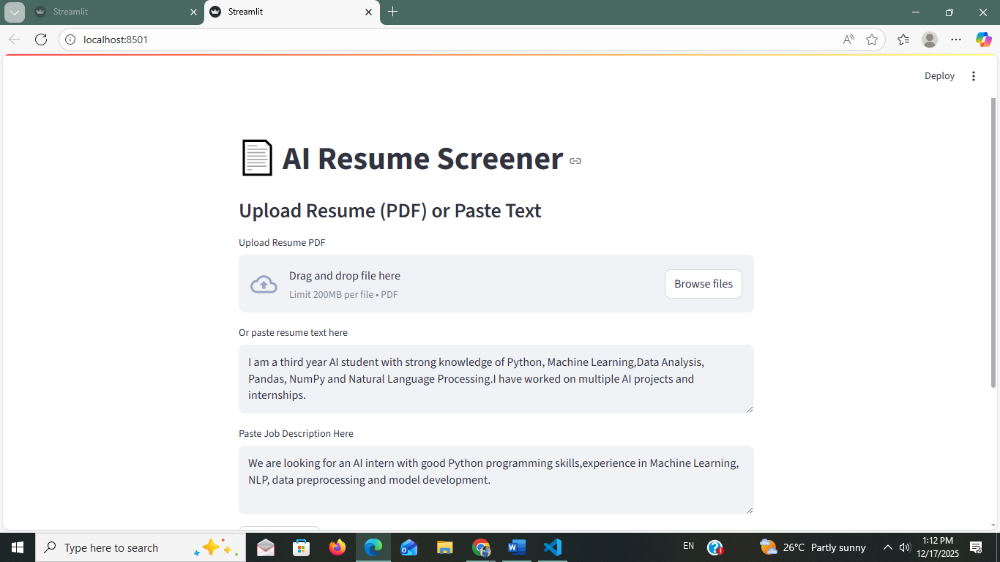
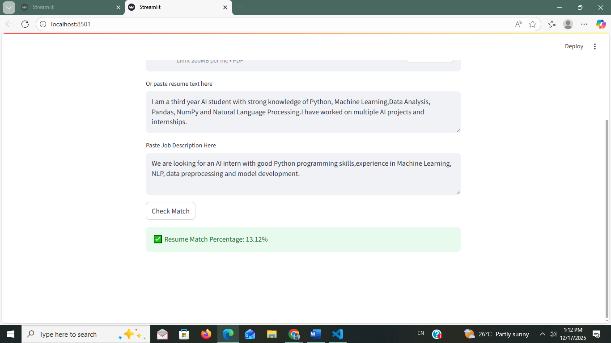

# AI Resume Screener using Python

## 📌 Project Overview
The AI Resume Screener is a Python-based application that uses
Natural Language Processing (NLP) techniques to evaluate how well
a candidate’s resume matches a given job description.

It helps recruiters automatically screen resumes and shortlist
candidates based on skill relevance.

---

## 🧠 Technologies Used
- Python
- Natural Language Processing (NLP)
- TF-IDF Vectorization
- Cosine Similarity
- Scikit-learn
- NLTK

---

## ⚙️ Project Workflow
1. Load resume and job description text files
2. Clean and preprocess text (lowercase, stopword removal)
3. Convert text into TF-IDF vectors
4. Calculate similarity using cosine similarity
5. Generate resume-job match percentage
6. Save output to a file

---

## 📂 Project Structure

## 📸 Screenshots

### Resume & Job Description Input

### Match Percentage Output

